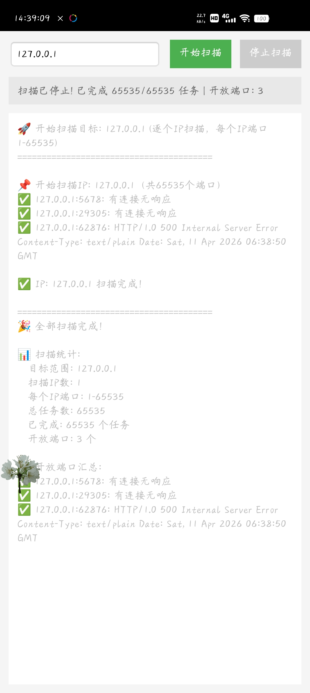

# 端口扫描

## 项目描述
Android端口扫描工具，支持快速扫描目标IP的开放端口

## 功能特性
- 端口扫描功能
- 多线程扫描（300线程）
- 可配置扫描范围（1-65535）
- 可配置超时时间（1200ms）
- 扫描结果实时显示
- 扫描状态监控

## 使用说明
输入目标IP地址，点击开始扫描即可查看开放端口

## 技术实现
- 多线程并发扫描
- 自定义线程池大小
- 可配置超时时间
- 实时扫描结果展示

## 项目结构
```
端口扫描/
├── app/
│   ├── src/
│   │   └── main/
│   │       ├── AndroidManifest.xml
│   │       ├── java/port/scan/MainActivity.java
│   │       └── res/
│   └── build.gradle
├── images/
│   └── 端口扫描.jpg
├── build.gradle
├── settings.gradle
└── README.md
```

## 应用截图

